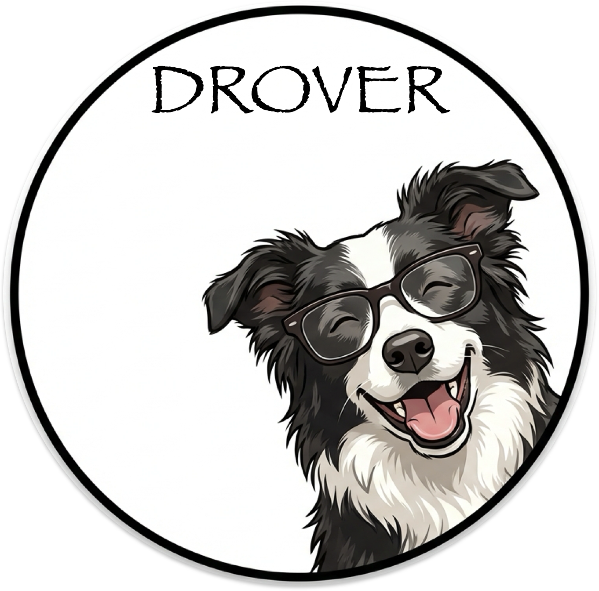

<p align="center">
  
</p>

# Drover

Document classification CLI that herds files into organized folder structures.

Named after herding dogs that drove livestock — Drover uses LLMs to analyze documents and suggest consistent, policy-compliant filesystem paths and filenames.

## Quick Start

### Installation

```bash
pip install -e .
```

### NLTK Data

Drover disables automatic NLTK downloads for privacy. You must pre-download the required packages once:

```python
import nltk
nltk.download('averaged_perceptron_tagger_eng')
nltk.download('punkt_tab')
```

### First Classification

```bash
# Using local Ollama (default)
drover classify document.pdf

# Using OpenAI
export OPENAI_API_KEY="sk-..."
drover classify document.pdf --ai-provider openai --ai-model gpt-4o
```

## Supported File Formats

| Category | Extensions |
|----------|------------|
| PDF | `.pdf` |
| Images | `.png`, `.jpg`, `.jpeg`, `.gif`, `.bmp`, `.tiff`, `.tif` |
| Office | `.docx`, `.doc`, `.xlsx`, `.xls`, `.pptx`, `.ppt` |
| Text | `.txt`, `.md` |
| Other | `.html`, `.htm`, `.csv`, `.tsv`, `.eml`, `.epub`, `.odt`, `.rtf` |

## Commands

### `drover classify`

Classify documents and output suggested file paths.

```bash
drover classify [OPTIONS] FILES...
```

**Options:**

| Option | Description |
|--------|-------------|
| `--config PATH` | Configuration file path |
| `--ai-provider {ollama,openai,anthropic,openrouter}` | AI provider (default: ollama) |
| `--ai-model MODEL` | Model name for the provider |
| `--ai-max-tokens N` | Maximum tokens in response (default: 1000) |
| `--taxonomy NAME` | Taxonomy for classification (default: household) |
| `--taxonomy-mode {strict,fallback}` | Handle unknown values (default: fallback) |
| `--naming-style NAME` | Filename policy (default: nara) |
| `--sample-strategy {full,first_n,bookends,adaptive}` | Page sampling (default: adaptive) |
| `--max-pages N` | Maximum pages to process (default: 10) |
| `--on-error {fail,continue,skip}` | Error handling mode |
| `--concurrency N` | Parallel processing (default: 1) |
| `--metrics` | Include AI metrics in output |
| `--capture-debug` | Save prompts/responses to files |
| `--debug-dir PATH` | Directory for debug output |
| `--log-level {quiet,verbose,debug}` | Logging verbosity (default: quiet) |
| `--batch` | Output JSONL for multiple files |
| `--prompt PATH` | Custom prompt template file |

**Examples:**

```bash
# Single document
drover classify invoice.pdf

# Multiple documents with batch output
drover classify *.pdf --batch

# Using a specific model
drover classify doc.pdf --ai-provider openai --ai-model gpt-4-turbo

# Verbose output with metrics
drover classify doc.pdf --log-level verbose --metrics

# Custom configuration file
drover classify doc.pdf --config my-config.yaml
```

### `drover tag`

Classify documents and apply macOS filesystem tags.

> **Note:** This command is only available on macOS.

```bash
drover tag [OPTIONS] FILES...
```

**Tag-specific Options:**

| Option | Description |
|--------|-------------|
| `--tag-fields FIELDS` | Comma-separated fields to tag (default: domain,category,doctype) |
| `--tag-mode {replace,add,update,missing}` | How to apply tags (default: add) |
| `--dry-run` | Preview tags without applying |

All `classify` options are also available.

**Valid tag fields:** `domain`, `category`, `doctype`, `vendor`, `date`, `subject`

**Examples:**

```bash
# Preview tags without applying
drover tag document.pdf --dry-run

# Tag with specific fields
drover tag --tag-fields domain,vendor document.pdf

# Replace all existing tags
drover tag --tag-mode replace document.pdf

# Tag multiple files
drover tag *.pdf --log-level verbose
```

### `drover evaluate`

Evaluate classification accuracy against ground truth data.

```bash
drover evaluate [OPTIONS] GROUND_TRUTH_PATH
```

**Options:**

| Option | Description |
|--------|-------------|
| `--documents-dir PATH` | Directory containing test documents (default: `documents/` next to ground truth file) |
| `--config PATH` | Configuration file path |
| `--ai-provider {ollama,openai,anthropic,openrouter}` | AI provider |
| `--ai-model MODEL` | Model name |
| `--taxonomy NAME` | Taxonomy for classification |
| `--output-format {summary,json}` | Output format (default: summary) |
| `--log-level {quiet,verbose,debug}` | Logging verbosity |

**Ground Truth Format (JSONL):**

```jsonl
{"filename": "bank_statement.pdf", "domain": "financial", "category": "banking", "doctype": "statement"}
{"filename": "electric_bill.pdf", "domain": "utilities", "category": "electric", "doctype": "bill", "vendor": "pge"}
```

**Examples:**

```bash
# Run evaluation with summary output
drover evaluate eval/ground_truth.jsonl

# Compare models with JSON output
drover evaluate eval/ground_truth.jsonl --ai-model gpt-4o --output-format json

# Specify documents directory
drover evaluate eval/ground_truth.jsonl --documents-dir ./test_docs/
```

## Configuration

### Config File Locations

Drover searches for configuration in this order:

1. Path specified with `--config`
2. `drover.yaml` in current directory
3. `~/.config/drover/config.yaml`

### Configuration Precedence

CLI options > config file > environment variables > defaults

### Environment Variables

| Variable | Description | Default |
|----------|-------------|---------|
| `DROVER_AI_PROVIDER` | AI provider | `ollama` |
| `DROVER_AI_MODEL` | Model name | `llama3.2:latest` |
| `DROVER_AI_TEMPERATURE` | LLM temperature (0.0-2.0) | `0.0` |
| `DROVER_AI_MAX_TOKENS` | Max tokens in response | `1000` |
| `DROVER_AI_TIMEOUT` | Request timeout (seconds) | `60` |
| `DROVER_TAXONOMY` | Taxonomy to use | `household` |
| `DROVER_TAXONOMY_MODE` | Validation mode | `fallback` |
| `DROVER_NAMING_STYLE` | Naming policy | `nara` |
| `DROVER_SAMPLE_STRATEGY` | Page sampling strategy | `adaptive` |
| `DROVER_MAX_PAGES` | Max pages to sample | `10` |
| `DROVER_LOG_LEVEL` | Logging verbosity | `quiet` |
| `DROVER_ON_ERROR` | Error handling | `fail` |
| `DROVER_CONCURRENCY` | Parallel processing | `1` |

### Example Configuration

```yaml
# drover.yaml
ai:
  provider: openai
  model: gpt-4o
  temperature: 0.0
  max_tokens: 1500

taxonomy: household
taxonomy_mode: fallback
naming_style: nara
sample_strategy: adaptive
max_pages: 10
log_level: quiet
on_error: continue
concurrency: 4
```

## AI Providers

### Ollama (Default)

Local LLM inference. No API key required.

```bash
drover classify doc.pdf --ai-provider ollama --ai-model llama3.2:latest
```

### OpenAI

Requires `OPENAI_API_KEY` environment variable.

```bash
export OPENAI_API_KEY="sk-..."
drover classify doc.pdf --ai-provider openai --ai-model gpt-4o
```

### Anthropic

Requires `ANTHROPIC_API_KEY` environment variable.

```bash
export ANTHROPIC_API_KEY="sk-ant-..."
drover classify doc.pdf --ai-provider anthropic --ai-model claude-sonnet-4-20250514
```

**Cost Optimization:** Drover automatically enables [prompt caching](https://docs.anthropic.com/en/docs/build-with-claude/prompt-caching) for Anthropic models. The taxonomy menu (~2000 tokens) is cached, reducing costs by up to 90% on subsequent requests.

### OpenRouter

Requires `OPENROUTER_API_KEY` environment variable.

```bash
export OPENROUTER_API_KEY="sk-or-..."
drover classify doc.pdf --ai-provider openrouter --ai-model anthropic/claude-sonnet-4
```

## Taxonomy & Classification

### Domains

The default `household` taxonomy classifies documents into 16 domains:

| Domain | Description |
|--------|-------------|
| `career` | Employment, job search, professional development |
| `education` | School, training, certifications |
| `financial` | Banking, credit, investments, taxes |
| `food` | Recipes, meal plans |
| `government` | Federal, state, local correspondence |
| `household` | Home goods, vehicles, maintenance |
| `housing` | Rental, property search |
| `insurance` | Auto, home, life, health policies |
| `legal` | Contracts, court documents, estate |
| `lifestyle` | Travel, hobbies, volunteering |
| `medical` | Health records, prescriptions, claims |
| `personal` | Identity documents, memberships |
| `pets` | Pet records and expenses |
| `property` | Home ownership, mortgage, improvements |
| `reference` | Manuals, guides |
| `utilities` | Electric, gas, water, internet bills |

### Taxonomy Modes

- **`fallback`** (default): Unknown values are mapped to "other" category
- **`strict`**: Unknown values raise an error

### Path Format

Classification generates paths in the format:

```
{domain}/{category}/{doctype}/{filename}
```

Example: `financial/banking/statement/statement-chase-checking-20240115.pdf`

### Filename Format (NARA)

The default NARA naming policy generates filenames as:

```
{doctype}-{vendor}-{subject}-{YYYYMMDD}.{ext}
```

Example: `invoice-home_depot-kitchen_faucet-20240220.pdf`

## Output Format

### JSON Output (Single File)

```json
{
  "original": "scan001.pdf",
  "suggested_path": "financial/banking/statement/statement-chase-checking-20240115.pdf",
  "suggested_filename": "statement-chase-checking-20240115.pdf",
  "domain": "financial",
  "category": "banking",
  "doctype": "statement",
  "vendor": "chase",
  "date": "20240115",
  "subject": "checking",
  "error": false
}
```

### JSONL Output (Batch Mode)

With `--batch`, each line is a separate JSON object:

```
{"original": "doc1.pdf", "suggested_path": "...", ...}
{"original": "doc2.pdf", "suggested_path": "...", ...}
```

### Error Output

```json
{
  "original": "corrupted.pdf",
  "error": true,
  "error_code": "DOCUMENT_LOAD_FAILED",
  "error_message": "Failed to load corrupted.pdf: No content extracted"
}
```

**Error Codes:**

| Code | Description |
|------|-------------|
| `DOCUMENT_LOAD_FAILED` | Could not read or parse document |
| `LLM_PARSE_ERROR` | LLM response could not be parsed |
| `LLM_API_ERROR` | API call to LLM failed |
| `TAXONOMY_VALIDATION_FAILED` | Classification violates taxonomy (strict mode) |
| `TEMPLATE_ERROR` | Prompt template error |
| `CONFIG_ERROR` | Invalid configuration |
| `FILENAME_POLICY_VIOLATION` | Generated filename violates policy |
| `UNEXPECTED_ERROR` | Unhandled error |

## Architecture

For architectural decisions and design rationale, see:

- [ADR-001: Chain-of-Thought Prompting](docs/adr/001-chain-of-thought-prompting.md) - 7-step reasoning for accurate classification
- [ADR-002: Privacy-First Design](docs/adr/002-privacy-first-design.md) - Local-first, zero telemetry approach

## Contributing

See [CONTRIBUTING.md](CONTRIBUTING.md) for development setup, architecture details, and contribution guidelines.

## License

MIT
