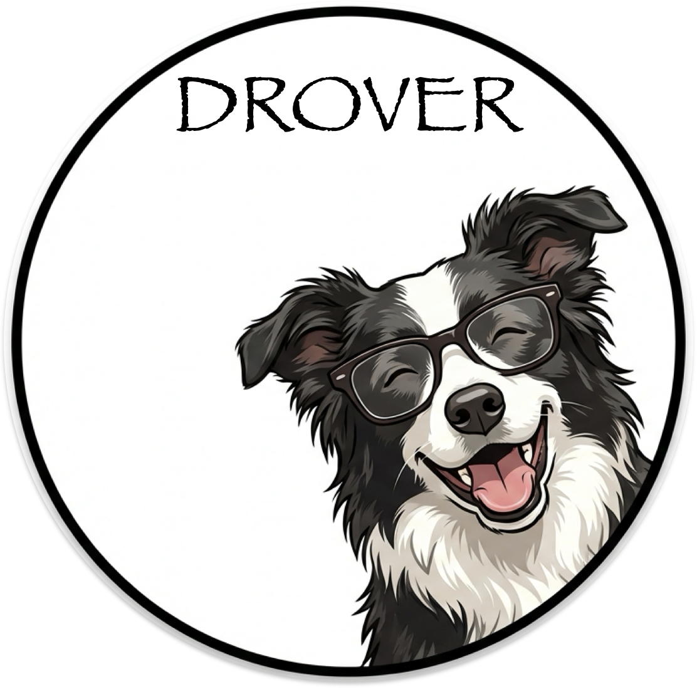

<p align="center">
  
</p>

<h1 align="center">Drover</h1>

<p align="center">
  <strong>AI-powered document classification that herds files into organized folders</strong>
</p>

<p align="center">
  <a href="#features">Features</a> •
  <a href="#quick-start">Quick Start</a> •
  <a href="#usage">Usage</a> •
  <a href="#configuration">Configuration</a> •
  <a href="#documentation">Documentation</a>
</p>

---

Drover uses LLMs to analyze documents and suggest consistent, policy-compliant filesystem paths and filenames. Named after herding dogs that drove livestock, Drover herds your scattered files into an organized folder structure.

## Features

- **Multi-Provider AI** — Works with Ollama (local), OpenAI, Anthropic, and OpenRouter
- **Intelligent Classification** — Categorizes documents by domain, category, and document type
- **Smart Sampling** — Adaptive page sampling for efficient processing of large documents
- **Taxonomy System** — Extensible controlled vocabularies with strict or fallback modes
- **NARA-Compliant Naming** — Generates standardized filenames: `{doctype}-{vendor}-{subject}-{date}.pdf`
- **macOS Tagging** — Apply classification as native filesystem tags
- **Batch Processing** — Classify multiple documents with JSONL output
- **Evaluation Framework** — Measure accuracy against ground truth datasets

## Quick Start

### Prerequisites

- Python 3.13.x
- [uv](https://docs.astral.sh/uv/) (package and environment manager)
- [Ollama](https://ollama.ai/) (for local inference) or API keys for cloud providers

### Installation

To install drover as a global CLI on your system, see [INSTALL.md](INSTALL.md). The steps below set up a development checkout for working on drover itself.

```bash
# Clone and sync the project (creates .venv and installs dependencies)
git clone https://github.com/ckrough/drover.git
cd drover
uv sync --extra docling

# Download Docling models (one-time, ~500 MB to ~/.cache/docling/models)
uv run docling-tools models download
```

Run the CLI through `uv run drover ...`, or activate the environment with `source .venv/bin/activate` to call `drover` directly.

#### About the Docling loader

Drover uses [Docling](https://docling-project.github.io/docling/) as the sole document loader, with full-page OCR enabled on PDFs so vendor names carried in logos and embedded images reach the classifier. The `[docling]` install extra and the one-time model download above are required. If you skip the download, Docling's first run fetches models from Hugging Face on demand (a few hundred MB, internet required); subsequent runs are fully offline. Rationale and the format-coverage policy live in [ADR-005](docs/adr/005-docling-evaluation.md) and [ADR-006](docs/adr/006-standardize-on-docling.md).

### Classify Your First Document

```bash
# Using local Ollama (default)
drover classify document.pdf

# Using OpenAI
export OPENAI_API_KEY="sk-..."
drover classify document.pdf --ai-provider openai --ai-model gpt-4o
```

## Usage

### Classify Command

Analyze documents and output suggested file paths:

```bash
drover classify invoice.pdf
drover classify *.pdf --batch                    # Multiple files, JSONL output
drover classify doc.pdf --metrics                # Include AI metrics
drover classify doc.pdf --log-level verbose      # Detailed logging
```

### Tag Command (macOS)

Classify and apply native filesystem tags:

```bash
drover tag document.pdf --dry-run                # Preview tags
drover tag document.pdf --tag-fields domain,vendor
drover tag --tag-mode replace document.pdf       # Replace existing tags
```

### Organize Command

Classify, optionally tag, and move files into a destination tree. `SRC` may be a single file or a directory; `--dest` is required.

```bash
# Move every supported file under ~/Inbox into ~/Documents/filed.
drover organize ~/Inbox --dest ~/Documents/filed

# Dry-run preview to stdout (one JSONL record per file).
drover organize ~/Inbox --dest ~/Documents/filed --dry-run --report -

# Single-file invocation suitable for Hazel rules or macOS Folder Actions.
drover organize ~/Inbox/scan.pdf --dest ~/Documents/filed \
  --tag-fields category,doctype \
  --report ~/Library/Logs/drover/run-$(date +%Y%m%d-%H%M%S).jsonl

# Copy instead of move; source preserved.
drover organize ~/Inbox --dest ~/Documents/filed --copy
```

Behavior:

- Default conflict policy is **skip**: if `{DEST}/{suggested_path}` already exists, the source is left in place and the record is `skipped_exists`. Re-running on the same source is idempotent.
- `--tag-fields` is validated against `domain, category, doctype, vendor, date, subject` at parse time. Tags are written only to the destination Drover produces; the source file is never tagged.
- The JSONL report is identical in `--dry-run` and live mode (status values are prefixed `would_` in dry-run). Records carry `original_path`, `suggested_path`, `final_destination`, `status`, `tags_applied`, and `error`.
- Stream discipline: log chatter goes to stderr (gated by `DROVER_LOG_LEVEL`); the JSONL report goes to the file you pass, or to stdout when `--report -`. Unsupported extensions surface as `skipped_unsupported` records and do not raise the exit code.

#### Hazel / Folder Action recipe

A Hazel rule that watches `~/Inbox/`, runs `drover organize` on every newly added file, and appends to a daily JSONL log:

```bash
drover organize "$1" \
  --dest ~/Documents/filed \
  --tag-fields category,doctype \
  --report ~/Library/Logs/drover/$(date +%Y-%m-%d).jsonl
```

Equivalent macOS Folder Action shell:

```bash
for f in "$@"; do
  /usr/local/bin/drover organize "$f" \
    --dest ~/Documents/filed \
    --tag-fields category,doctype \
    --report ~/Library/Logs/drover/$(date +%Y-%m-%d).jsonl
done
```

### Evaluate Command

Measure classification accuracy against ground truth:

```bash
drover evaluate eval/ground_truth/synthetic.jsonl
drover evaluate eval/ground_truth/synthetic.jsonl --output-format json
```

### Output Format

```json
{
  "original": "scan001.pdf",
  "suggested_path": "financial/banking/statement/statement-chase-checking-20240115.pdf",
  "domain": "financial",
  "category": "banking",
  "doctype": "statement",
  "vendor": "chase",
  "date": "20240115",
  "subject": "checking"
}
```

## Configuration

### Environment Variables

| Variable | Description | Default |
|----------|-------------|---------|
| `DROVER_AI_PROVIDER` | AI provider (ollama, openai, anthropic, openrouter) | `ollama` |
| `DROVER_AI_MODEL` | Model name | `gemma4:latest` |
| `DROVER_TAXONOMY` | Classification taxonomy | `household` |
| `DROVER_NAMING_STYLE` | Filename policy | `nara` |
| `DROVER_SAMPLE_STRATEGY` | Page sampling (full, first_n, bookends, adaptive) | `adaptive` |
| `DROVER_LOG_LEVEL` | Logging verbosity (quiet, verbose, debug) | `quiet` |

### Config File

Drover searches for configuration in order: `--config PATH` → `drover.yaml` → `~/.config/drover/config.yaml`

```yaml
# drover.yaml
ai:
  provider: openai
  model: gpt-4o
  temperature: 0.0

taxonomy: household
taxonomy_mode: fallback
naming_style: nara
concurrency: 4
```

### AI Providers

| Provider | API Key Variable | Example Model |
|----------|------------------|---------------|
| Ollama | — (local) | `gemma4:latest` |
| OpenAI | `OPENAI_API_KEY` | `gpt-4o` |
| Anthropic | `ANTHROPIC_API_KEY` | `claude-sonnet-4-20250514` |
| OpenRouter | `OPENROUTER_API_KEY` | `anthropic/claude-sonnet-4` |

## Supported File Formats

The loader is Docling, so the supported set matches Docling's officially-supported formats per [`docs/usage/supported_formats`](https://docling-project.github.io/docling/usage/supported_formats/). See [ADR-006](docs/adr/006-standardize-on-docling.md) for the audit.

| Category | Extensions |
|----------|------------|
| PDF | `.pdf` |
| Office (Open XML) | `.docx`, `.xlsx`, `.pptx` |
| Markup | `.txt`, `.md`, `.html`, `.htm` |
| Data | `.csv` |
| Images | `.png`, `.jpg`, `.jpeg`, `.tiff`, `.tif`, `.bmp` |

## Architecture

Drover follows a pipeline architecture with extensible plugin systems:

```
[Document] → [Loader] → [Classifier] → [PathBuilder] → [Output]
                ↓             ↓              ↓
           [Sampling]   [Taxonomy]    [NamingPolicy]
```

**Tech Stack:**
- **CLI:** Click
- **LLM:** LangChain with structured output
- **Config:** Pydantic
- **Logging:** structlog

## Development

```bash
# Install with dev dependencies
uv sync --all-extras

# Run tests
uv run pytest

# Run end-to-end smoke suite (LLM tests need Ollama; emits JSON report under smoke/reports/)
uv run python smoke/run.py             # full suite (~2 min)
uv run python smoke/run.py --skip-llm  # CLI + error-path tests only (~10s)
# See smoke/README.md for the test catalog and report schema.

# Lint and format
uv run ruff check src/ --fix && uv run ruff format src/

# Security scan
uv run bandit -r src/ -c pyproject.toml
```

See [CONTRIBUTING.md](CONTRIBUTING.md) for the full development workflow.

## Documentation

- [Contributing Guide](CONTRIBUTING.md) — Development setup, architecture, and extension guides
- [ADR-001: Chain-of-Thought Prompting](docs/adr/001-chain-of-thought-prompting.md) — 7-step reasoning for accurate classification
- [ADR-002: Privacy-First Design](docs/adr/002-privacy-first-design.md) — Local-first, zero telemetry approach
- [ADR-003: NLI Classifier Roadmap](docs/adr/003-nli-classifier-roadmap.md) — Zero-shot NLI exploration (superseded by ADR-004)
- [ADR-004: Local LLM as Primary Local Path](docs/adr/004-local-llm-as-primary-local-path.md) — Ollama gemma4 as the default local classifier
- [ADR-005: Docling with Full-Page OCR as the Default PDF Loader](docs/adr/005-docling-evaluation.md) — Structure-aware loading with OCR over logos and embedded images for accurate folder placement

## License

MIT
