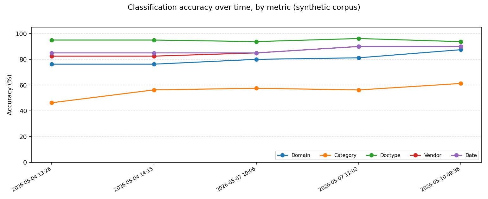

# Drover Evaluation Suite

Ground-truth corpora, run logs, accuracy dashboard, and chart artifacts for benchmarking drover's classifier.

## Layout

| Path | Purpose |
|---|---|
| `ground_truth/synthetic.jsonl` | Labels for the 80-document synthetic corpus (committed). |
| `ground_truth/real-world.jsonl` | Labels for the 14-document real-world corpus (gitignored, PII). |
| `samples/synthetic/` | Synthetic PDFs (committed). |
| `samples/real-world/` | Real-world PDFs (gitignored, PII). |
| `runs/<name>/results.md` | Per-run accuracy summary (committed when free of PII). |
| `runs/<name>/*.json`, `*.stderr` | Per-document dumps and verbose logs (gitignored). |
| `dashboard.html`, `dashboard_data.json` | Aggregated dashboard, regenerated by `scripts/build_eval_dashboard.py`. |
| `charts/` | Static PNGs regenerated by `scripts/build_eval_charts.py`. |

## Accuracy over time

All committed runs, faceted by corpus, with each accuracy metric as its own line. Use this view to spot regressions across loader, taxonomy, or OCR-backend changes.



The interactive equivalent lives in [dashboard.html](dashboard.html); load it locally (file:// works, no server needed) for tooltips and run-level metadata.

## Reproducing

Both charts and the dashboard are derived from `dashboard_data.json`, which itself is built from the per-run `*.json` files (gitignored) under `runs/`. After adding a new run:

```bash
uv run python scripts/build_eval_dashboard.py   # updates dashboard.html + dashboard_data.json
uv run python scripts/build_eval_charts.py      # updates charts/*.png
```

Both scripts are idempotent.

## Conventions

- Run directories use a descriptive prefix and a `YYYYMMDD-HHMMSS` (or `YYYY-MM-DDTHHMMSS`) timestamp so the dashboard can parse the date.
- `results.md` is the human-readable canonical artifact for a run; raw JSON dumps are local-only.
- The synthetic corpus is curated to be PII-free. Real-world artifacts (PDFs, ground-truth labels, per-doc dumps) are gitignored.
- See ADR-005 and ADR-006 in `docs/adr/` for the loader policy that drives most of these runs.
